# Especificação do MVP — Pontuação de atletas

Versão: 0.2 — revisão de consistência do brainstorm  
Status: regras consolidadas e revisadas; decisões abertas identificadas, refinamento técnico e implantação pendentes.

Este documento reúne as decisões confirmadas com o proprietário do produto. Quando uma regra foi alterada durante o brainstorm, prevalece a decisão mais recente registrada aqui. Propostas técnicas e questões ainda abertas estão identificadas separadamente; não devem ser tratadas como requisitos aprovados.

Escopo de trabalho acordado: produzir documentação, instruções, skills, agentes e configuração de MCP para o GitHub Copilot no VS Code. A implementação da aplicação ficará com o Copilot. Esta revisão altera apenas documentação. O registro da revisão está em [revisao-consistencia-mvp.md](revisao-consistencia-mvp.md).

### Precedência das regras

1. Conta de atleta cancelada: dados e pendências ocultos e suspensos para usuários comuns; atleta excluído do cálculo dos rankings. O proprietário pode consultar e administrar esses dados e pendências mesmo durante o cancelamento. O atleta pode solicitar recuperação de senha e confirmar reativação nos fluxos exclusivos definidos.
2. Conta de profissional inativa: sem acesso, mas mantém seleção, notificações e pendências. Conta cancelada: sem acesso, seleção ou notificações; demandas vão ao proprietário. Isso não encerra vínculos nem remove seus atletas dos rankings.
3. Sobre os participantes restantes, aplicar autorização da temporada, vínculo e permissão para a operação. O encaminhamento de uma demanda ao proprietário não supera a regra 1.
4. Na consulta esportiva, considerar somente resultados aprovados e não cancelados. Na temporada, calcular posições sobre todo o conjunto elegível antes de aplicar filtros de visibilidade do observador.

Os fluxos locais abaixo devem ser lidos com essas condições, inclusive quando omitidas para simplificar o diagrama. Conta cancelada, vínculo encerrado, inscrição cancelada e resultado cancelado são eventos diferentes; reativar conta não restaura os três últimos.

## 1. Objetivo e escopo

Controlar colocações de atletas em campeonatos e convertê-las em pontos nas temporadas de seus profissionais, com rankings geral e por categoria, aprovação de resultados pelos atletas e relatórios em tela, PDF e Excel.

### Dentro do MVP

- Contas, pré-cadastro, liberação de acesso e vínculo entre atletas e profissionais.
- Perfil exclusivo do proprietário, profissionais/administradores e consulta pelos demais perfis conforme elegibilidade.
- Catálogos de organizadores, categorias e classes administrados pelo proprietário.
- Catálogo compartilhado de campeonatos e solicitação de alteração ao proprietário.
- Temporadas com criador, administradores convidados, profissionais com acesso de consulta, campeonatos e tabela de pontos.
- Solicitação, aprovação, reprovação, remoção e reinscrição em campeonatos.
- Lançamento de colocações por categoria e classe, aprovação/reprovação pelo atleta e intervenções do proprietário.
- Rankings dinâmicos, lista de pendências, notificações por e-mail e histórico das decisões.
- Relatórios analíticos e sintéticos com exportação PDF e Excel (.xlsx).

### Visão futura — fora do MVP

- Google Calendar, disponibilidade por profissional, autoagendamento e confirmação de consultas.
- Pré-cadastro integrado ao agendamento.
- Treinos, exercícios, nutrição e demais funcionalidades clínicas/esportivas.
- Compartilhamento de dados de atendimento e permissões por especialidade e vínculo com o paciente.

A visão futura não deve ser uma dependência para publicar o MVP de pontuação.

## 2. Conceitos do domínio

| Conceito | Definição confirmada |
|---|---|
| Proprietário | Dono do software, com acesso irrestrito, inclusive aos dados e pendências de atletas com conta cancelada. |
| Profissional | Usuário que atende atletas; pode criar temporadas e receber permissões administrativas em outras. |
| Vínculo | Relação entre atleta e profissional. Um atleta pode ter vários profissionais. |
| Organizador | Registro do catálogo central, obrigatório no cadastro do campeonato. |
| Campeonato | Evento compartilhado entre profissionais e temporadas. Não pertence exclusivamente a uma temporada. |
| Categoria | Classificação do catálogo central, selecionada no lançamento do resultado. |
| Classe | Classe da categoria, selecionada no lançamento. Cada categoria possui um único Overall por campeonato. |
| Temporada | Conjunto de campeonatos, critérios e tabela de pontos definido por um profissional criador. Possui início e encerramento. |
| Inscrição | Participação confirmada de um atleta em um campeonato, independente de quantas categorias e classes disputar. |
| Resultado | Colocação do atleta em uma categoria e classe do campeonato. |
| Pontos | Valor derivado de resultado aprovado, usando a tabela da temporada. Não é um valor universal do campeonato. |

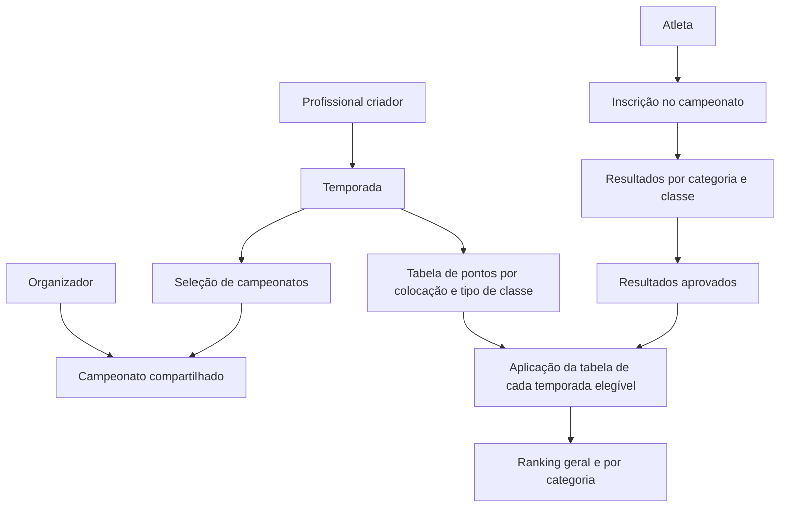

## 3. Perfis e permissões

| Ator | Permissões e limites |
|---|---|
| Proprietário | Administra contas, catálogos, temporadas, resultados e pendências; pode cancelar e reativar atletas e intervir em resultados. O cancelamento da conta do atleta não restringe seu acesso administrativo. |
| Criador da temporada | Administra sua temporada, tabela e campeonatos associados; concede consulta e administração a outros profissionais/administradores. |
| Administrador convidado | Administra a temporada para a qual foi autorizado, incluindo tabela e composição de campeonatos. |
| Profissional com consulta | Consulta a temporada autorizada; essa permissão não concede administração nem aprovação de inscrições. |
| Profissional autorizado para um atleta/campeonato | Precisa estar vinculado ao atleta e criar ou administrar pelo menos uma temporada contendo o campeonato. Pode aprovar/reprovar inscrição, cadastrar diretamente e operar resultados ainda não aprovados. |
| Atleta | Solicita conta/inscrição, consulta conforme elegibilidade e aprova/reprova seus resultados. |
| Demais perfis autenticados | Consulta sujeita às regras de autorização e visibilidade; o detalhamento para perfis sem vínculo de atleta/profissional permanece pendente. |

Regras adicionais:

- Todo acesso a relatórios exige login.
- O perfil de administrador isoladamente não concede administração de todas as temporadas.
- A conta do proprietário não aparece em listagens comuns nem em seletores de usuários. Sua identidade interna é preservada para auditoria; a ocultação também deve valer nas respostas da API usadas nessas consultas.
- Permissões devem ser verificadas no backend, não apenas na interface.
- Convites para administrar uma temporada não incluem automaticamente os atletas do convidado no ranking: a composição depende do vínculo com o criador.

### Visibilidade das justificativas

| Operação | Obrigatória? | Quem pode consultar o motivo registrado |
|---|---|---|
| Reprovação de solicitação de vínculo | Sim | Somente proprietário |
| Encerramento de vínculo | Sim | Somente proprietário |
| Reprovação de inscrição em campeonato | Sim | Histórico interno; atleta não acessa. Perfis internos exatos ainda pendentes |
| Reprovação de resultado pelo atleta | Sim | Profissionais autorizados para corrigir e proprietário; o motivo é informado pelo atleta |

A ocultação por conta de atleta cancelada restringe usuários comuns, não o proprietário, inclusive quanto a justificativas e históricos. Não confundir preenchimento de justificativa com permissão de consulta posterior.

## 4. Contas e pré-cadastro

Todo atleta precisa de conta. O cadastro e a liberação são administrados pelo profissional/administrador.

No cadastro direto de um novo atleta pelo profissional, o vínculo com esse profissional é criado automaticamente, sem aprovação adicional do atleta. Essa exceção não se aplica à solicitação de vínculo com atleta já cadastrado, que continua dependendo da aprovação do destinatário. Vínculo automático não dispensa a liberação inicial da conta nem a inscrição confirmada para acesso a uma temporada.

No pré-cadastro iniciado pelo atleta, a liberação da conta pelo profissional responsável selecionado estabelece automaticamente o vínculo entre ambos, sem uma segunda aprovação. Antes dessa liberação, o pré-cadastro não estabelece vínculo ativo nem concede acesso.

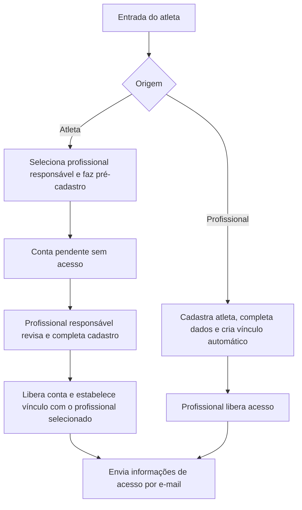

O envio de identificador de login e link temporário para definição de senha é a proposta técnica já apresentada, ainda dependente do fechamento de validade, reenvio e recuperação de conta. Não enviar senha em texto no e-mail.

### Cancelamento e reativação da conta do atleta

- O próprio atleta e o proprietário podem cancelar a conta do atleta. Profissionais não podem cancelar ou inativar globalmente a conta de um atleta vinculado a eles.
- Enquanto cancelada, a conta do atleta não aparece em listagens de seleção e não recebe notificações de negócio. A recuperação de senha solicitada pelo próprio atleta é a exceção definida abaixo.
- O próprio atleta pode reativar sua conta. Ao informar login e senha corretos para uma conta cancelada, acessa somente uma tela exclusiva com a opção “Reativar minha conta”. Validar credenciais não reativa a conta automaticamente nem libera acesso ao restante do sistema.
- Somente após confirmar a reativação, recupera o acesso conforme as permissões vigentes e são aplicadas as regras de retorno dos dados, rankings e pendências. Se não confirmar, a conta permanece cancelada.
- O atleta com conta cancelada pode solicitar e-mail de recuperação de senha. Esse envio solicitado pelo próprio atleta é uma exceção à suspensão de notificações.
- Recuperar ou redefinir a senha não reativa a conta. Após autenticar com a nova senha, o atleta continua sujeito à tela exclusiva e à confirmação explícita de reativação. Validade, uso único e demais detalhes do mecanismo de recuperação serão definidos no refinamento técnico.
- Proposta técnica: a autorização temporária emitida após validar credenciais de conta cancelada deve permitir somente o fluxo de reativação, sem acesso às demais APIs protegidas. A forma de implementação será definida no refinamento técnico para o Copilot.

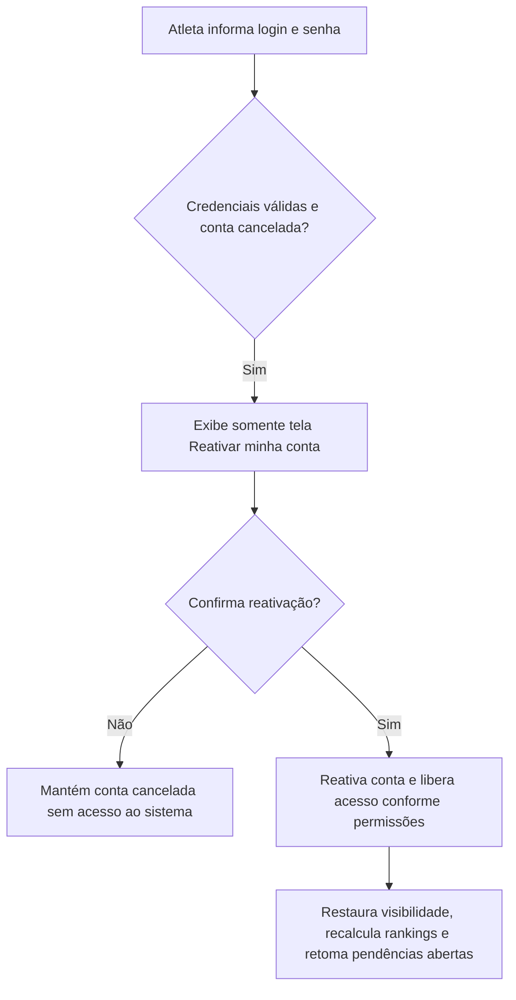
- O cancelamento preserva vínculos, inscrições, resultados e dados de participação nos rankings, ocultando-os dos usuários comuns enquanto a conta estiver cancelada. O proprietário pode consultá-los e administrá-los no sistema e nas exportações administrativas. Isso não reinclui o atleta nos rankings vigentes.
- Após reativação pelo atleta, esses dados voltam a aparecer conforme as permissões, vínculos e regras de elegibilidade vigentes. Reativação da conta não significa reativar resultados ou inscrições que tenham sido cancelados por seus próprios fluxos.
- Enquanto a conta estiver cancelada, os rankings geral e por categoria são recalculados desconsiderando o atleta, ajustando as posições dos demais, sem reservar sua posição anterior.
- Na reativação, os rankings elegíveis são recalculados incluindo seus resultados aprovados e não cancelados, com as tabelas vigentes. As colocações originais dos campeonatos são preservadas; esse recálculo altera as posições nos rankings de temporada.
- As pendências relacionadas ao atleta ficam preservadas, ocultas e suspensas para usuários comuns durante o cancelamento. O proprietário pode visualizá-las e administrá-las sem reativar a conta.
- Na reativação, as pendências ainda abertas voltam a ficar disponíveis para tratamento conforme as permissões vigentes. Isso não reabre demandas já resolvidas nem define reenvio automático de e-mails.
- O encaminhamento de demandas de um profissional cancelado ao proprietário pode incluir demandas de atletas com conta cancelada, pois o proprietário mantém autorização para administrá-las.
- Os efeitos do cancelamento sobre usuários comuns e rankings aplicam-se independentemente de quem cancelou; o proprietário mantém acesso administrativo irrestrito.
- O atleta pode reativar a própria conta mesmo quando o cancelamento foi realizado pelo proprietário, sem aprovação administrativa. Aplica-se o mesmo fluxo de credenciais válidas e confirmação explícita na tela exclusiva de reativação, independentemente de quem cancelou.
- O proprietário também pode reativar a conta do atleta por ação administrativa, sem exigir login ou confirmação do atleta. A reativação aplica as mesmas regras de retorno da visibilidade, rankings e pendências.
- Decisão D15: o proprietário confirmou que seus acessos irrestritos substituem a decisão anterior de ocultação de atletas cancelados inclusive para ele. A ocultação e suspensão permanecem apenas para usuários comuns.
- As regras já definidas de pré-cadastro e liberação inicial de acesso pelo profissional permanecem distintas do cancelamento posterior pelo atleta.

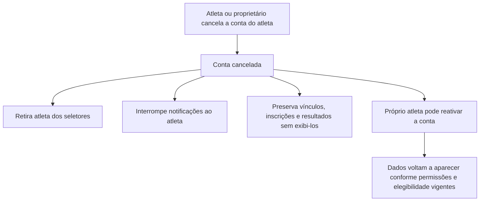

### Cadastro de profissionais

- Somente o proprietário pode cadastrar novos profissionais, liberar acesso, inativar e reativar suas contas.
- Outros profissionais e administradores não podem executar essas operações em contas de profissionais, mesmo quando administram temporadas.
- A inativação bloqueia apenas o acesso do profissional ao sistema. Preserva seus vínculos, temporadas, rankings e o acesso dos atletas conforme as regras existentes. Inativar a conta não equivale a encerrar vínculos nem remove atletas da classificação.
- Profissionais inativos continuam disponíveis para seleção em pré-cadastros e para receber novas solicitações de vínculo. A inatividade não rejeita nem aprova essas solicitações automaticamente.
- As pendências são registradas durante a inatividade. Após reativação, o profissional pode consultar e tratar as que ainda aguardam sua ação, preservando o histórico das que já tenham sido resolvidas por outro usuário autorizado.
- Os e-mails de notificação continuam sendo enviados normalmente durante a inatividade.
- Essa restrição não altera o cadastro e a liberação de atletas pelos profissionais, conforme o fluxo acima.

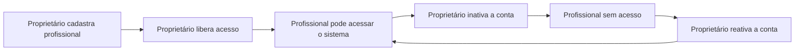

### Conta de profissional cancelada

- Deve existir um estado/código específico para conta cancelada, distinto da conta inativa. O valor técnico do código ainda não foi definido; este requisito não implica alteração de código da aplicação nesta etapa.
- Conta cancelada não recebe mais notificações e não aparece nas listas de seleção para novos pré-cadastros, solicitações e vínculos.
- As demandas do profissional cancelado devem aparecer para o proprietário tratar, incluindo pendências existentes e demandas posteriores decorrentes dos registros existentes. Isso não muda automaticamente o criador das temporadas nem transfere vínculos.
- A exclusão dos seletores não significa apagar o histórico do profissional.
- O cancelamento preserva vínculos existentes, temporadas, rankings e consultas dos atletas conforme as regras de acesso vigentes. Não encerra vínculos nem remove atletas da classificação por si só.
- Somente o proprietário pode reverter o cancelamento e reativar a conta do profissional. O cancelamento não é definitivo.
- Ao retornar ao estado ativo, o profissional recupera acesso ao sistema, disponibilidade nos seletores de novas solicitações/vínculos e recebimento de novas notificações, respeitando suas permissões vigentes.
- Após a reversão do cancelamento e reativação, as demandas ainda abertas que foram direcionadas ao proprietário retornam automaticamente ao profissional. Demandas já resolvidas não são reabertas. O proprietário mantém seu acesso global ao histórico e às demandas.
- A reativação não envia e-mail de aviso ou resumo de pendências e não dispara reenvio automático de notificações antigas. As pendências ficam disponíveis no sistema; novas notificações seguem os fluxos normais.

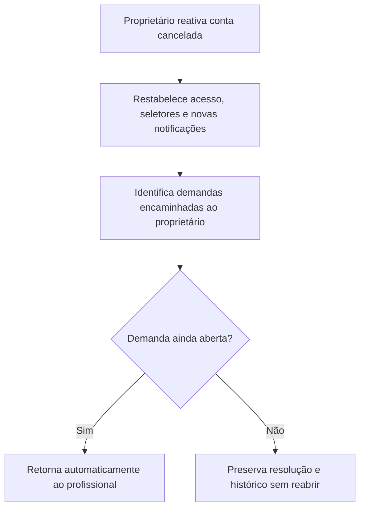

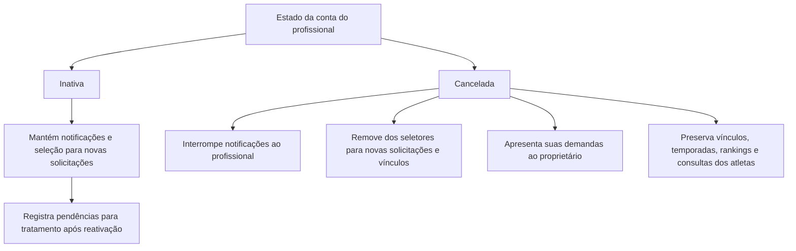

Pendências: campos obrigatórios, unicidade e validação de identidade/e-mail e demais etapas do ciclo das contas de profissionais.

## 5. Catálogos e campeonatos

- Apenas o proprietário administra organizadores, categorias e classes.
- O profissional pode criar campeonato, obrigatoriamente selecionando organizador.
- Campeonatos ficam disponíveis para seleção por outros profissionais em suas temporadas, independentemente de quem os criou.
- Profissionais não editam diretamente um campeonato existente: enviam solicitação de alteração para aprovação do proprietário.
- Categorias/classes não são previamente selecionadas para compor o campeonato; são informadas ao lançar o resultado do atleta.
- Há várias classes comuns e um único Overall por categoria por campeonato. Isso não significa um Overall único para o campeonato inteiro.
- Um atleta pode obter várias primeiras colocações no campeonato, em combinações diferentes de categoria e classe; vários atletas também podem ser primeiros em classes distintas.

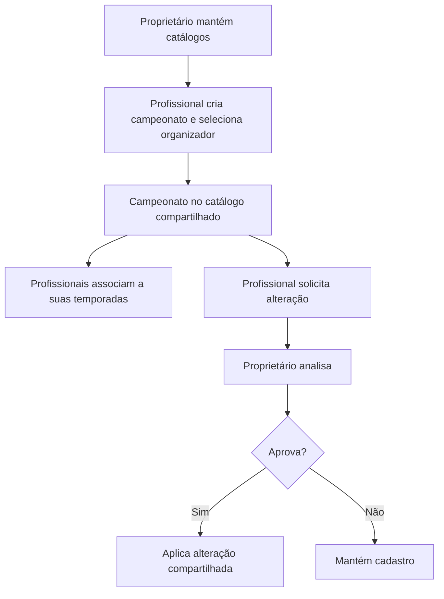

Pendências: campos do campeonato, prevenção de eventos duplicados, identificação de edições, significado de alterações em catálogos já utilizados e categorias/classes inativas.

## 6. Temporadas, elegibilidade e acesso

### Administração

- A temporada possui criador, data de início e encerramento, critérios e tabela própria de pontos.
- O criador seleciona profissionais para consulta e pode conceder administração a outros administradores.
- Criador e administradores podem alterar a tabela e adicionar/remover campeonatos mesmo após resultados lançados.
- Campeonatos fora do período da temporada podem ser associados normalmente.
- Mudanças na tabela ou na seleção de campeonatos recalculam os rankings. Remover associação não remove o campeonato, suas inscrições ou seus resultados.
- O conteúdo dos critérios adicionais da temporada ainda precisa ser especificado.

### Elegibilidade do atleta

Um atleta participa do cálculo e da consulta de uma temporada quando as três condições forem atendidas:

1. Possui vínculo atual com o profissional criador da temporada.
2. Possui inscrição confirmada e não cancelada em pelo menos um campeonato associado à temporada.
3. Sua conta não está cancelada. O acesso interativo também exige conta liberada e autenticação; pré-cadastro não concede acesso.

O vínculo sozinho não libera acesso. A inscrição em um campeonato pode incluir automaticamente o atleta em várias temporadas elegíveis.

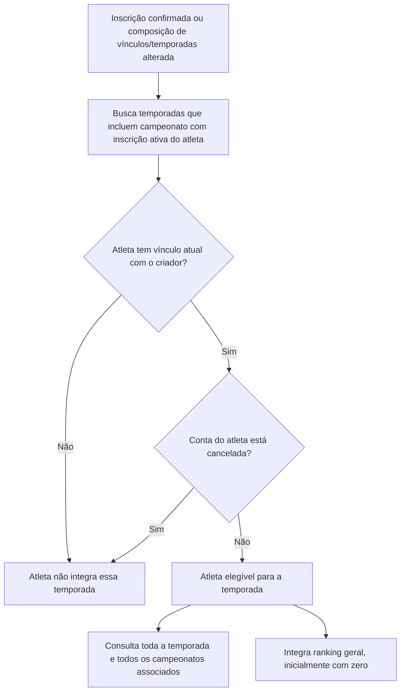

### Visibilidade e universo do ranking

- O ranking da temporada é calculado sobre os atletas elegíveis do criador; não é recalculado para cada pessoa que consulta.
- O profissional vê nos relatórios somente atletas vinculados a ele.
- O atleta vê a si e os atletas que compartilham pelo menos um profissional com ele, dentro do universo autorizado da temporada/consulta.
- O proprietário vê todos os atletas e seus dados, inclusive contas canceladas, em consultas administrativas. Os rankings da temporada continuam excluindo atletas com conta cancelada, independentemente de quem consulta.
- O atleta elegível pode consultar todos os campeonatos da temporada, mesmo aqueles em que não se inscreveu.
- A consulta de campeonato ocorre no contexto de uma temporada autorizada; o catálogo usado para solicitar inscrição não deve ser confundido com acesso a resultados.
- A seleção de profissionais convidados para consulta não concede acesso aos atletas deles se esses atletas não forem elegíveis pelo criador.

Consequência: o filtro de visibilidade pode ocultar participantes de um ranking já calculado. A forma visual de comunicar lacunas de posições deve ser validada no desenho do relatório.

### Vínculos e histórico

#### Solicitação e aprovação do vínculo

- O atleta escolhe os profissionais com os quais deseja se vincular.
- Um atleta já cadastrado pode solicitar vínculo com outro profissional, dependendo da aprovação desse profissional.
- O profissional também pode solicitar vínculo com um atleta; nesse caso, o atleta precisa aprovar para que o vínculo seja estabelecido.
- Solicitação pendente não estabelece vínculo nem concede permissões decorrentes dele.
- Após aprovação, aplicam-se as regras de elegibilidade de temporadas e de consideração dos resultados anteriores. O vínculo sozinho continua não sendo suficiente para liberar uma temporada.

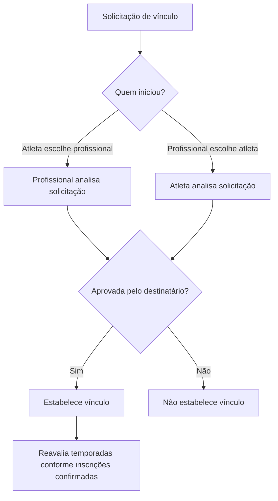

#### Reprovação, novas tentativas e solicitações cruzadas

- O destinatário pode reprovar a solicitação de vínculo, obrigatoriamente informando justificativa. Sem justificativa, a reprovação não é concluída.
- A justificativa fica no histórico e pode ser consultada exclusivamente pelo proprietário, não sendo disponibilizada em consultas ou notificações às partes.
- Após reprovação, qualquer uma das partes pode iniciar uma nova solicitação. O histórico da tentativa anterior é preservado.
- Existe no máximo uma solicitação pendente por par atleta/profissional, independentemente de quem a iniciou.
- Se a pendência foi iniciada pela outra parte, bloquear nova solicitação e informar que já existe uma solicitação aguardando aprovação. O destinatário pode decidir sobre a existente.
- Se a pendência foi iniciada pelo próprio usuário, permitir reenvio para notificar novamente o destinatário, mantendo a mesma solicitação e sem criar duplicidade.
- A regra é simétrica: aplica-se tanto ao atleta solicitante quanto ao profissional solicitante.

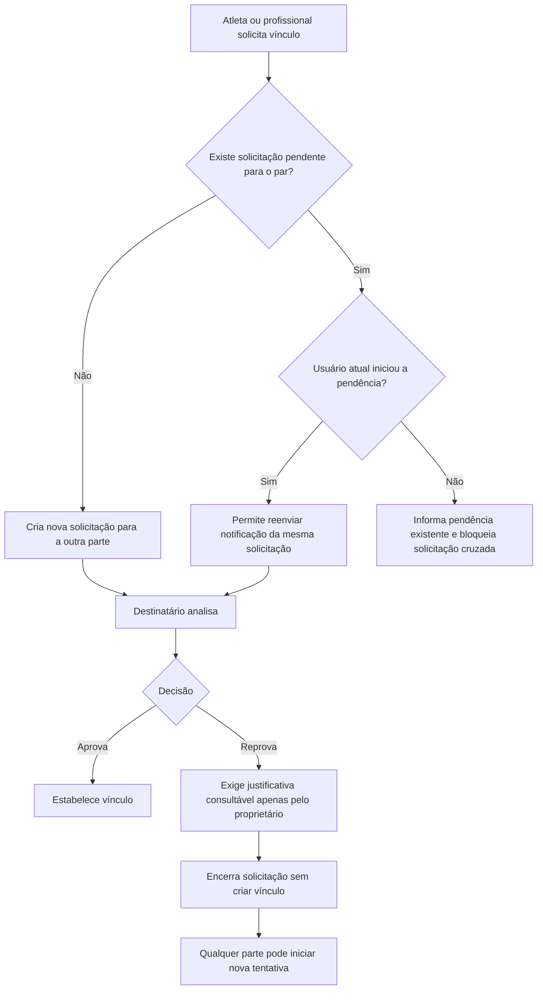

As solicitações de vínculo e seus reenvios notificam o destinatário por e-mail. A aprovação ou reprovação notifica o solicitante por e-mail, sem incluir a justificativa de reprovação, consultável exclusivamente pelo proprietário. A regra é simétrica para atleta e profissional. O encerramento de vínculo já estabelecido continua sem envio de e-mail.

Pendências específicas: textos finais dos e-mails e limites de reenvio.

#### Encerramento do vínculo

- Tanto o atleta quanto o profissional podem encerrar diretamente o vínculo entre si, sem aprovação da outra parte.
- O encerramento afeta apenas esse vínculo; os vínculos com outros profissionais permanecem.
- Aplicam-se imediatamente as regras de elegibilidade, visibilidade e autorização baseadas no vínculo atual, incluindo a retirada dos rankings das temporadas criadas pelo profissional desligado, mesmo encerradas.
- O encerramento do vínculo não cancela inscrições nem resultados dos campeonatos.
- Proposta de auditoria: preservar o vínculo encerrado com responsável e data, sem apagar seu histórico.
- O encerramento registra uma justificativa no histórico, sem enviar notificação por e-mail à outra parte.
- Apenas o proprietário pode consultar a justificativa de encerramento registrada. Ela não é disponibilizada em consultas, relatórios ou respostas da API para atletas e profissionais, inclusive para quem a informou.
- O preenchimento da justificativa é obrigatório para concluir o encerramento. Sem justificativa preenchida, o vínculo permanece ativo.

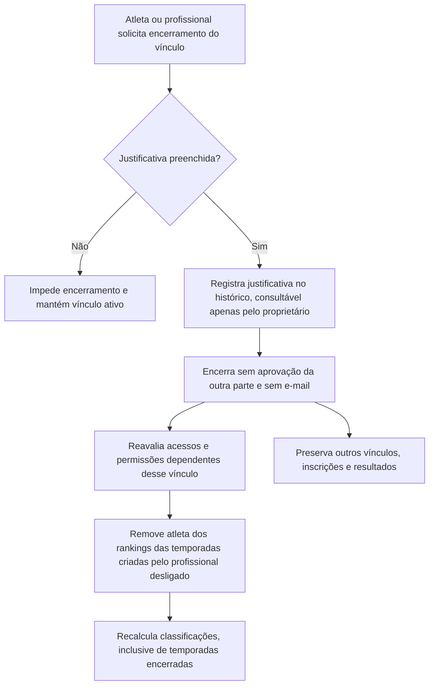

#### Efeitos sobre as temporadas

- Ao encerrar vínculo com o criador, o atleta sai dos rankings da temporada e perde a elegibilidade correspondente.
- Isso ocorre também em temporadas encerradas, com todos os campeonatos concluídos.
- Ao se vincular a um novo profissional, resultados anteriores ao vínculo contam em suas temporadas, desde que os campeonatos estejam associados e a inscrição esteja confirmada.
- Manter vários vínculos permite participação simultânea nas temporadas elegíveis de vários criadores.
- As colocações históricas dos campeonatos são preservadas. Relatórios de temporadas passadas podem mudar devido aos vínculos atuais.

## 7. Inscrição e aprovação

### Destinatários da solicitação

1. Buscar temporadas às quais o campeonato está associado.
2. Identificar profissionais criadores ou administradores dessas temporadas.
3. Filtrar os que possuem vínculo com o atleta.
4. Se houver elegíveis, notificar por e-mail, sem duplicar destinatários, e mostrar a pendência nas respectivas temporadas.
5. Sem profissional elegível, impedir a solicitação e orientar o atleta a procurar seu profissional. Não criar pendência nem enviar e-mail.

Quem pode aprovar e em quais temporadas o atleta entra são regras distintas: a aprovação pode vir de administrador convidado vinculado ao atleta, mas a inclusão exige vínculo com o criador de cada temporada.

É permitido confirmar a inscrição mesmo sem nenhuma temporada elegível para o atleta. Nesse caso, a inscrição fica confirmada no campeonato, mas não concede consulta a temporada nem ao relatório do campeonato por si só. Se posteriormente houver temporada elegível, a inscrição já confirmada será considerada automaticamente pelas regras existentes, sem exigir nova inscrição.

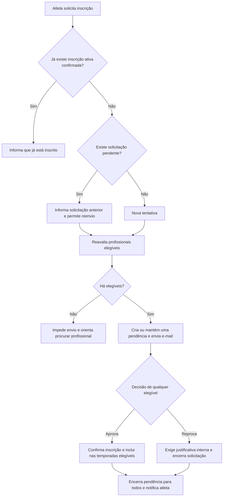

### Decisões e novas tentativas

- A aprovação de qualquer elegível resolve a solicitação para todos e libera todas as temporadas elegíveis. Não há aprovação separada por temporada.
- A reprovação de qualquer elegível também resolve para todos.
- Reprovação exige justificativa do profissional, guardada somente no histórico interno. O atleta não a recebe no e-mail nem a consulta no sistema.
- O atleta recebe e-mail tanto de aprovação quanto de reprovação.
- Solicitação pendente pode ser reenviada: reaproveita a mesma solicitação, apenas notifica novamente os elegíveis atuais.
- Após reprovação, o atleta pode abrir nova solicitação; um profissional autorizado também pode cadastrá-lo diretamente.
- Cadastro direto por profissional autorizado confirma inscrição sem aprovação adicional de inscrição pelo atleta. A aprovação do resultado é outra etapa.

### Perda de autorização durante a aprovação de inscrição

- Se um aprovador perder o vínculo com o atleta ou sua permissão de administração da temporada, não poderá mais decidir sobre a solicitação pendente por essa autorização anterior.
- Reavaliar os demais profissionais atualmente elegíveis e redistribuir a mesma pendência entre eles, sem criar uma nova solicitação.
- Se não restar profissional elegível, direcionar a pendência existente ao proprietário.
- Isso não altera o bloqueio de uma nova solicitação que já nasce sem profissional elegível. O encaminhamento trata uma solicitação existente que perdeu seus aprovadores.
- A redistribuição de solicitações de inscrição não substitui automaticamente a aprovação pessoal do atleta em outros fluxos. O proprietário mantém seu poder de intervenção administrativa, inclusive em pendências de atleta com conta cancelada.
- Inatividade da conta profissional não equivale a perda de vínculo/administração: preserva suas pendências conforme a regra específica de inativação. Cancelamento de conta profissional segue seu encaminhamento já definido.

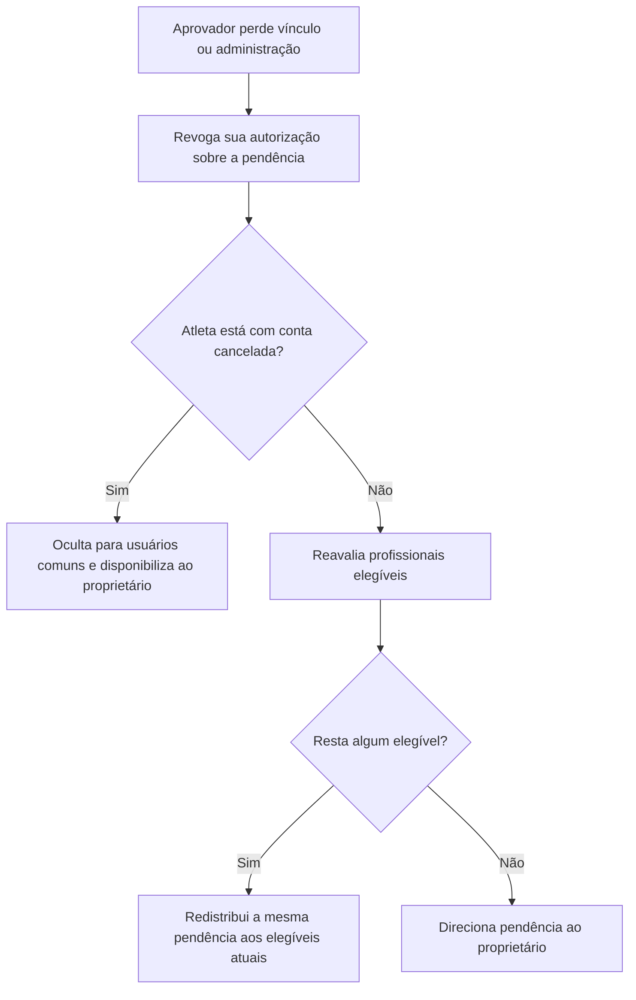

### Remoção e reinscrição

- Sem nenhum lançamento, profissional autorizado pode remover diretamente a inscrição.
- Com lançamentos, deve solicitar remoção ao proprietário.
- Remoção aprovada preserva resultados como cancelados, excluindo-os dos relatórios e cálculos, com reavaliação dos acessos e rankings afetados.
- É permitido solicitar reinscrição; resultados cancelados nunca são reativados. Novos resultados devem ser lançados para a nova participação.
- Deve existir no máximo uma inscrição ativa por atleta/campeonato, preservando ciclos anteriores no histórico.

**Histórico também exige aprovação:** se a inscrição possui qualquer lançamento no histórico, mesmo que todos tenham sido removidos/cancelados, sua remoção depende da aprovação do proprietário. A remoção direta pelo profissional autorizado só é permitida se nunca houve lançamento nessa inscrição. Cancelar resultados não elimina essa exigência.

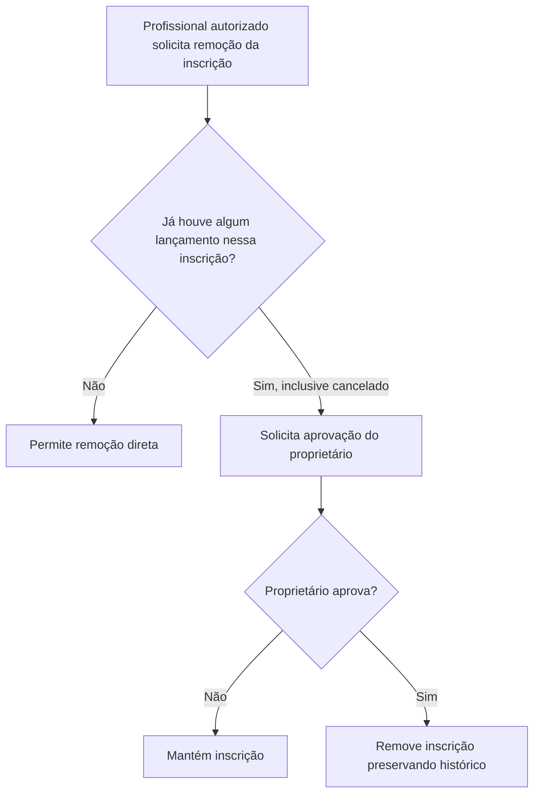

## 8. Resultados e validação pelo atleta

- O lançamento informa atleta inscrito, campeonato, categoria, classe e colocação.
- Qualquer colocação pode ser registrada, inclusive sem pontos previstos.
- Profissional vinculado ao atleta que cria/administra uma temporada contendo o campeonato pode lançar resultados.
- O lançamento fica pendente, e o atleta recebe e-mail para aprovação.
- Apenas resultados aprovados aparecem nos relatórios e geram pontos.
- Enquanto pendente ou reprovado, profissionais autorizados podem alterar ou remover.
- Reprovação pelo atleta exige justificativa, exibida aos profissionais autorizados na lista de pendências.
- Correção deve retornar à aprovação do atleta.
- Depois de aprovado, profissionais não podem alterar/remover. O proprietário mantém permissão global.
- Alteração de resultado aprovado pelo proprietário tem efeito imediato, sem nova aprovação do atleta, atualizando todas as temporadas afetadas.
- Cancelamentos preservam histórico e não permitem reativar o lançamento.

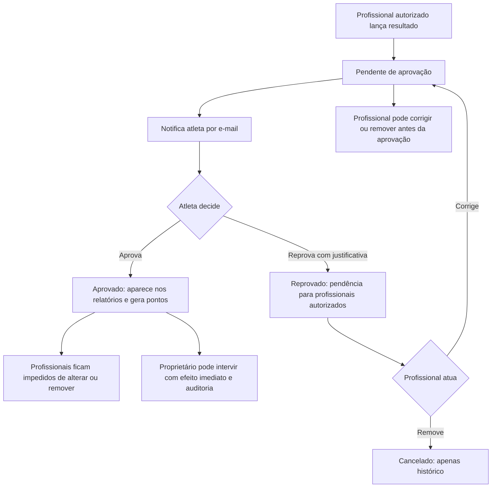

Proposta de consistência: aprovação vinculada à versão atual do resultado; atualização concorrente deve impedir aprovação de versão desatualizada. Preservar ator, data, versões e justificativas. Evitar duplicação de resultado ativo para a mesma participação/categoria/classe.

Pendências: limite/validação da colocação, empate dentro da mesma classe, registro de desclassificação/ausência, forma de confirmação pelo atleta e notificações após intervenções do proprietário.

## 9. Pontuação e rankings

### Tabela da temporada

- Valores por colocação, distinguindo classe comum e Overall.
- Mesma pontuação para todas as categorias, dada a mesma colocação e tipo de classe.
- Valores decimais permitidos. Precisão máxima, arredondamento e aceitação de zero/negativos ainda precisam ser fechados; o código atual sugere três casas decimais, mas isso não foi explicitamente aprovado como limite.
- Colocação não prevista na tabela vale zero.
- Alteração da tabela pelo criador/administrador recalcula também resultados anteriores e temporadas encerradas.

### Composição

- Pontos são calculados para cada temporada usando resultados aprovados, não cancelados, dos campeonatos associados, para atletas elegíveis.
- Excluir atletas com conta cancelada antes de calcular posições. Aplicar filtros de visibilidade do observador depois de calcular o ranking: filtro de consulta não é motivo para renumerar posições.
- Ranking geral soma todas as categorias e classes, incluindo Overall.
- Ranking por categoria soma resultados daquela categoria, incluindo seu Overall.
- Inscrição confirmada em campeonato elegível inclui o atleta no ranking geral com zero, mesmo sem resultados.
- Ranking por categoria inclui atleta apenas após resultado aprovado nessa categoria, mesmo que valha zero.
- Totais iguais compartilham posição. Critérios de desempate serão definidos futuramente.
- Numeração após empate (1, 1, 3 ou 1, 1, 2) permanece pendente.
- Relatório de campeonato mostra colocações, nunca pontos. Pontos existem na consulta de temporada, incluindo seu detalhamento por campeonato.

### Exemplo validado no brainstorm

| Temporada | Campeonato | Atleta | Categoria | Classe | Colocação | Pontos na temporada |
|---|---|---|---|---|---|---:|
| 2025 | Mr Rio | Rafael | Culturismo Clássico | 1 | 1º | 5 |
| 2025 | Mr Rio | Rafael | Culturismo Clássico | Master | 1º | 5 |
| 2025 | Mr Rio | Rafael | Culturismo Clássico | Overall | 1º | 10 |
| 2025 | Mr Rio | Yan | Culturismo Clássico | 2 | 1º | 5 |

Com todos os resultados aprovados e ambos elegíveis, Rafael acumula 20 e Yan 5 na temporada. Os valores ilustram a tabela dessa temporada, não constantes do sistema.

## 10. Relatórios e exportações

| Escopo | Sintético | Analítico |
|---|---|---|
| Temporada | Ranking geral ou por categoria, atleta, posição e total | Origem dos pontos por campeonato, categoria, classe e colocação; subtotais e total |
| Campeonato | Colocações por categoria e classe, sem pontos | Participações e colocações detalhadas por atleta, sem pontos; layout final a validar |

- Consulta em tela e exportações PDF/Excel (.xlsx).
- Mesmos filtros e permissões de dados em tela e exportação.
- Ocultar atletas cancelados das consultas e novas exportações de usuários comuns. O proprietário pode consultar/exportar os dados administrativamente; isso não altera o universo dos rankings vigentes. Arquivos já baixados não são alterados retroativamente; links e arquivos armazenados devem aplicar a autorização vigente.
- Relatório analítico geral da temporada inclui inscritos elegíveis sem resultados aprovados: “Sem resultado”, total zero, sem expor lançamentos pendentes/reprovados.
- Na visão por categoria, respeitar a entrada após primeiro resultado aprovado.
- Arquivos devem identificar data/hora da geração, pois a classificação é dinâmica.
- Histórico de auditoria/cancelamentos é separado dos relatórios esportivos.

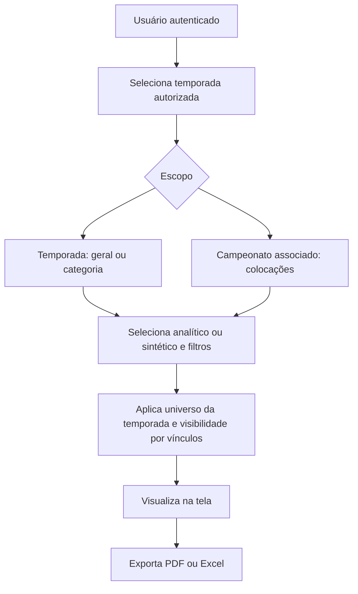

Pendências: colunas definitivas, ordenação, filtros, agrupamentos, identidade visual, formato numérico, volume e geração de arquivos grandes.

## 11. Pendências, e-mails e auditoria

### Lista de pendências do profissional

- Pré-cadastros aguardando revisão/liberação pelo responsável.
- Solicitações de inscrição em que o profissional é elegível para decidir.
- Solicitações de vínculo recebidas pelo profissional, com aprovação ou reprovação pelo destinatário.
- Resultados reprovados pelo atleta, com justificativa para correção/remoção.

Pendências de atleta com conta cancelada permanecem ocultas e suspensas para usuários comuns, mas disponíveis ao proprietário. Demandas de profissional cancelado vão ao proprietário e retornam se ainda abertas após reativação; demandas resolvidas não são reabertas.

Solicitações de alteração de campeonato e de remoção com lançamentos são atribuições do proprietário; formato de sua fila e notificações ainda precisa ser definido.

### Eventos com e-mail definido

| Evento | Destinatário | Observação |
|---|---|---|
| Liberação de conta | Atleta | Informações para acesso |
| Solicitação/reenvio de inscrição | Profissionais elegíveis atuais | Uma solicitação ativa; destinatários únicos |
| Aprovação/reprovação de inscrição | Atleta | Reprovação sem justificativa interna |
| Resultado enviado para validação | Atleta | Deve conferir colocação antes de aprovar |
| Solicitação/reenvio de vínculo | Destinatário da solicitação (atleta ou profissional) | Reenvio mantém a mesma pendência |
| Aprovação/reprovação de vínculo | Solicitante (atleta ou profissional) | Não inclui a justificativa de reprovação |
| Recuperação de senha solicitada por atleta com conta cancelada | Próprio atleta | Exceção à suspensão de e-mails; redefinir senha não reativa a conta |

Outros e-mails não devem ser presumidos como aprovados. Entrega, novas tentativas, controle de reenvio e provedor são decisões técnicas pendentes. Proposta: decisão de negócio persistida independentemente da entrega do e-mail.

| Estado do destinatário | Aplicação das notificações acima |
|---|---|
| Profissional inativo | Envia normalmente |
| Profissional cancelado | Não envia; suas demandas são apresentadas ao proprietário, sem presumir e-mail substituto ao proprietário |
| Atleta com conta cancelada | Não envia notificações de negócio; permite recuperação de senha solicitada por ele |
| Profissional reativado | Novos eventos notificam normalmente; não há resumo nem reenvio retroativo |
| Atleta reativado | Novos eventos seguem regras normais; e-mail de retorno/resumo de pendências não foi definido |

### Histórico necessário

Preservar decisões de inscrição, justificativas com controle de visibilidade, versões dos resultados, aprovação pelo atleta, intervenções do proprietário, cancelamentos e ciclos de reinscrição. Registrar responsável e data. Definir acesso interno, retenção e apresentação da auditoria no refinamento técnico.

## 12. Mudanças de entendimento consolidadas

| Entendimento anterior | Regra vigente |
|---|---|
| Um resultado por atleta/campeonato | Um resultado ativo por participação/categoria/classe; múltiplos resultados no campeonato |
| Pontos e total no relatório do campeonato | Campeonato mostra apenas colocações; pontos pertencem à temporada |
| Qualquer autenticado vê tudo | Login e autorização por temporada, elegibilidade e vínculos de visibilidade |
| Vínculo sozinho libera temporada | Vínculo atual com criador mais inscrição confirmada em campeonato associado |
| Profissional pode corrigir resultado a qualquer momento | Após aprovação do atleta, apenas proprietário intervém |
| Reprovação de inscrição sem justificativa | Justificativa obrigatória interna, não acessível ao atleta |
| Período poderia limitar/congelar temporada | Campeonatos fora do período são permitidos e rankings permanecem dinâmicos |
| Inscrição única sem ciclos | Uma ativa por atleta/campeonato, com ciclos cancelados preservados e novos lançamentos na reinscrição |
| Ocultação de atleta cancelado também para o proprietário | Regra substituída: proprietário pode consultar e administrar dados e pendências; restrição permanece para usuários comuns |
| Vínculo e inscrição suficientes para ranking | Conta de atleta cancelada é excluída antes de calcular posições |
| Inatividade e cancelamento equivalentes | Profissional inativo recebe solicitações/e-mails; cancelado sai dos seletores e demandas vão ao proprietário |
| Cancelamento de conta remove histórico | Dados preservados; conta do atleta cancelada oculta dados e suspende pendências até reativação |

## 13. Impacto sobre o repositório atual

Base observada na análise inicial: Java 17, Spring Boot 3.2.2, Maven, JPA, MySQL, JWT e módulos de usuário, competição, competidores, pontuação e histórico. Este documento não implementa mudanças.

| Área atual | Necessidade para o MVP |
|---|---|
| Competição e competidores | Catálogo compartilhado, organizador, inscrições com estados, histórico de tentativas e ciclos |
| Pontuação ligada à competição | Tabela de pontos por temporada, colocação e tipo de classe |
| Histórico de pontuação | Resultado com categoria/classe, aprovação, versões, justificativas e cancelamento |
| Ausência de temporada no modelo analisado | Temporada, campeonatos associados, permissões e critérios |
| Perfis de usuário sem autorização efetiva | Proprietário, escopo de temporada, vínculo e autorização por operação |
| Usuário | Pré-cadastro, aprovação, ativação por e-mail e vínculo muitos-para-muitos com profissionais |
| Consultas de total agrupadas por nome | Agregação por identificador do atleta e universo elegível da temporada |
| Configuração de banco/segredos no código | Configuração por ambiente e tratamento dos segredos já expostos |
| Base64 + MD5 para senhas | Substituição com estratégia de transição das contas existentes |
| SQL disperso e ddl-auto=update | Migrações controladas e estratégia para preservar dados existentes |
| Ausência de suíte de testes no repositório analisado | Testes de autorização, cálculo, estados e integração com banco isolado |
| Ausência de exportações/e-mails/observabilidade | Implementação e operação dessas capacidades |

A análise inicial compilou 124 arquivos Java. A etapa de testes offline não concluiu por dependência do Surefire ausente no cache; não havia fontes de testes. A aplicação não foi iniciada contra o banco remoto. Esses fatos são uma linha de base, não validação funcional do novo MVP.

## 14. Direção técnica proposta — ainda sujeita ao refinamento

- Evoluir a aplicação Spring existente com módulos de domínio delimitados; não há decisão aprovada de reescrita ou divisão em serviços.
- Separar resultado factual do campeonato do cálculo de pontos por temporada.
- Separar conta, vínculo profissional, permissão na temporada, solicitação e inscrição.
- Modelar estados explícitos e transições autorizadas, em vez de usar somente flags genéricas.
- Garantir unicidade de inscrição ativa, solicitação pendente e resultado ativo na combinação apropriada.
- Resolver decisões concorrentes de aprovação/reprovação de forma atômica; primeira decisão concluída encerra a pendência.
- Validar aprovação do atleta contra a versão que ele efetivamente consultou.
- Manter cálculo decimal exato e ordenação determinística sem inventar critérios de desempate.
- Decidir entre cálculo sob consulta e materialização após estimar volume; assegurar recálculo por alterações em vínculos, resultados, tabelas e campeonatos associados.
- Separar envio de e-mail da transação principal com mecanismo confiável de entrega e reenvio.
- Construir a matriz de autorização antes dos contratos finais da API.
- Definir migração das contas, competições e pontuações atuais somente após conhecer dados existentes e ambiente real.

## 15. Cenários de aceite iniciais

Estes cenários traduzem regras confirmadas; serão detalhados em testes após fechar o modelo técnico.

Pré-condições gerais: aplicar a precedência da abertura do documento. Cenários ordinários pressupõem contas com acesso permitido e atleta não cancelado; cenários de cancelamento/reativação explicitam suas exceções. Os IDs existentes são preservados para rastreabilidade.

| ID | Cenário | Resultado esperado |
|---|---|---|
| AC01 | Atleta vinculado ao criador, sem inscrição confirmada | Não integra nem acessa a temporada por esse vínculo sozinho |
| AC02 | Primeira inscrição confirmada em campeonato associado | Entra no ranking geral com zero e pode consultar todos os campeonatos da temporada elegível |
| AC03 | Inscrição sem resultado aprovado por categoria | Não aparece no ranking por categoria |
| AC04 | Resultado aprovado com colocação fora da tabela | Aparece na categoria com zero; campeonato exibe colocação sem pontos |
| AC05 | Mesmo resultado pertence a duas temporadas com tabelas diferentes | Mesma colocação, pontos calculados separadamente |
| AC06 | Qualquer aprovador elegível decide inscrição | Pendência encerrada para todos, com decisão única e e-mail ao atleta |
| AC07 | Solicitação pendente reenviada | Nenhuma duplicação; notifica elegíveis atuais |
| AC08 | Nenhum profissional elegível | Solicitação impedida, sem e-mail ou nova pendência |
| AC09 | Profissional reprova inscrição | Motivo obrigatório no histórico e ausente da resposta/e-mail do atleta |
| AC10 | Atleta reprova resultado | Justificativa obrigatória; pendência para profissionais e nenhum ponto publicado |
| AC11 | Profissional tenta editar resultado aprovado de atleta com conta não cancelada | Operação negada; proprietário pode alterar com efeito imediato |
| AC12 | Atleta encerra vínculo com criador de temporada encerrada | Sai da classificação; demais posições são recalculadas |
| AC13 | Atleta inicia vínculo com outro criador | Resultados anteriores em campeonatos associados entram no cálculo se elegível |
| AC14 | Campeonato removido da temporada | Seus resultados deixam o cálculo; atletas/acessos são reavaliados sem apagar campeonato |
| AC15 | Tabela alterada pelo administrador autorizado | Todos os resultados aplicáveis usam a nova tabela |
| AC16 | Reinscrição após cancelamento | Nova participação; resultados antigos continuam cancelados e precisam de novos lançamentos |
| AC17 | Exportação de relatório | Respeita mesmo universo e visibilidade da tela; campeonato não contém pontos |
| AC18 | Consulta comum de usuários | Conta do proprietário ausente, inclusive dos seletores |
| AC19 | Outro administrador tenta cadastrar ou liberar profissional | Operação negada; somente o proprietário pode executar essas ações |
| AC20 | Outro administrador tenta inativar ou reativar profissional | Operação negada; somente o proprietário pode executar essas ações |
| AC21 | Proprietário inativa profissional | Profissional perde acesso; vínculos, temporadas, rankings e consultas dos atletas permanecem conforme as regras existentes |
| AC22 | Atleta seleciona profissional inativo em pré-cadastro ou solicita vínculo | Operação permitida; pendência é registrada e permanece disponível após reativação enquanto não resolvida |
| AC23 | Nova notificação para profissional inativo | E-mail enviado normalmente |
| AC24 | Conta de profissional cancelada | Não recebe notificações, não aparece nos seletores de novas solicitações/vínculos e suas demandas ficam disponíveis ao proprietário |
| AC25 | Profissional com atletas e temporadas tem conta cancelada | Vínculos existentes, temporadas, rankings e consultas dos atletas são preservados; cancelamento não equivale a encerramento de vínculo |
| AC26 | Proprietário reverte cancelamento e reativa profissional | Conta volta ao estado ativo, com acesso conforme permissões vigentes, presença nos seletores e recebimento de novas notificações |
| AC27 | Reativação após demandas direcionadas ao proprietário | Demandas ainda abertas retornam automaticamente ao profissional; as resolvidas permanecem encerradas e o proprietário mantém acesso global |
| AC28 | Pendências retornam ao profissional na reativação | Ficam disponíveis no sistema sem e-mail de resumo ou reenvio automático de notificações antigas; novos eventos seguem as regras normais de notificação |
| AC29 | Atleta cancela a própria conta | Vínculos, inscrições, resultados e dados de participação nos rankings são preservados, mas ocultos das consultas e relatórios; conta não recebe notificações; o próprio atleta pode reativá-la |
| AC30 | Profissional tenta cancelar ou inativar globalmente conta de atleta | Operação negada, mesmo com vínculo ou administração de temporada |
| AC31 | Atleta reativa sua conta cancelada | Dados preservados voltam a ser exibidos conforme permissões e elegibilidade vigentes, sem reativar resultados ou inscrições cancelados separadamente |
| AC32 | Conta de atleta classificado é cancelada | Rankings são recalculados sem esse atleta, ajustando posições dos demais e preservando as colocações históricas dos campeonatos |
| AC33 | Atleta reativa conta com resultados preservados | Rankings elegíveis são recalculados com resultados aprovados e não cancelados e tabelas vigentes, sem garantia de recuperar a posição anterior |
| AC34 | Atleta com pendências cancela conta | Pendências são preservadas, ocultas e suspensas para usuários comuns; proprietário mantém acesso para consulta e administração |
| AC35 | Atleta reativa conta com pendências suspensas | Pendências ainda abertas voltam a ficar disponíveis conforme permissões vigentes; demandas resolvidas não são reabertas |
| AC36 | Atleta com conta cancelada informa credenciais corretas | Acessa somente tela de reativação; não recupera automaticamente acesso às demais funcionalidades ou APIs |
| AC37 | Atleta confirma reativação na tela exclusiva | Conta é reativada, acesso é liberado conforme permissões e são aplicadas as regras de retorno de dados, rankings e pendências |
| AC38 | Atleta com conta cancelada solicita recuperação de senha | Recebe e-mail de recuperação, mas conta permanece cancelada após redefinir senha até confirmação explícita de reativação |
| AC39 | Proprietário cancela conta de atleta | Cancelamento permitido, ocultando dados dos usuários comuns e recalculando rankings, sem restringir acesso administrativo do proprietário |
| AC40 | Atleta reativa conta cancelada pelo proprietário | Reativação permitida após credenciais válidas e confirmação explícita, sem aprovação do proprietário, aplicando o retorno de dados, rankings e pendências conforme as regras vigentes |
| AC41 | Proprietário consulta atleta cancelado por listagem, detalhe ou exportação administrativa | Dados são disponibilizados ao proprietário, mantendo ocultação para usuários comuns e exclusão dos rankings vigentes |
| AC42 | Conta de profissional é cancelada, mas demanda envolve atleta também cancelado | Demanda é disponibilizada ao proprietário para tratamento; usuários comuns continuam sem acesso |
| AC43 | Solicitante repete solicitação de vínculo ainda pendente | Reenvia notificação da mesma solicitação sem criar outra pendência |
| AC44 | Destinatário tenta abrir solicitação inversa de vínculo | Informa solicitação pendente existente e impede duplicação cruzada |
| AC45 | Destinatário reprova vínculo sem justificativa | Não conclui reprovação; motivo é obrigatório e, registrado, consultável só pelo proprietário, inclusive se a conta do atleta estiver cancelada |
| AC46 | Administrador convidado vinculado ao atleta aprova inscrição sem existir temporada elegível | Inscrição confirmada sem liberar acesso a temporadas; vínculo apenas com o administrador convidado não concede acesso à temporada do criador |
| AC47 | Aprovador de inscrição perde autorização e existem outros elegíveis | Impede decisão pelo aprovador sem autorização e redistribui a mesma pendência aos profissionais elegíveis atuais |
| AC48 | Solicitação existente perde todos os aprovadores elegíveis | Encaminha pendência ao proprietário, que pode tratá-la inclusive quando a conta do atleta estiver cancelada |
| AC49 | Profissional solicita remoção de inscrição cujo histórico contém apenas resultados cancelados | Exige aprovação do proprietário; cancelar todos os resultados não autoriza remoção direta da inscrição |
| AC50 | Proprietário reativa conta cancelada de atleta | Reativação administrativa permitida, sem aprovação do atleta, aplicando regras vigentes de retorno dos dados, rankings e pendências |

## 16. Decisões abertas após revisão

Os itens abaixo são lacunas reais. Regras já confirmadas de cancelamento, reativação e vínculos não devem ser reabertas sem nova orientação do proprietário. O registro de revisão detalha o impacto e distingue decisão de negócio de desenho técnico.

### Decisões concluídas após a revisão

- **D01 — concluída:** vínculo automático no cadastro direto de novo atleta pelo profissional; no pré-cadastro iniciado pelo atleta, vínculo automático no momento em que o profissional selecionado libera a conta. Novos vínculos com atleta já cadastrado continuam sujeitos à aprovação do destinatário.
- **D02 — concluída:** inscrição pode ser confirmada por aprovador autorizado mesmo sem nenhuma temporada elegível; confirmação não dispensa o vínculo com o criador para acesso à temporada.
- **D03 — concluída para solicitações de inscrição:** perda de autorização redistribui aos elegíveis atuais; sem nenhum, encaminha ao proprietário. Após D15, conta de atleta cancelada não impede tratamento pelo proprietário.
- **D04 — concluída:** qualquer lançamento no histórico da inscrição exige aprovação do proprietário para removê-la, inclusive quando todos os resultados estão cancelados. Remoção direta apenas se nunca houve lançamento nessa inscrição.
- **D05 — concluída:** proprietário e próprio atleta podem reativar a conta do atleta.
- **D15 — concluída:** proprietário pode consultar e administrar dados e pendências de atleta cancelado. A antiga restrição ao proprietário foi substituída; rankings continuam excluindo a conta cancelada.

### P0 — decisões funcionais que afetam modelo e autorização

| ID | Decisão aberta | Por que importa |
|---|---|---|
| D06 | Quais campos são obrigatórios para atleta, profissional, campeonato, temporada e catálogos? Quais são os critérios adicionais da temporada? | Definir formulários, validação e estrutura dos dados |
| D07 | Como identificar campeonato duplicado e sua edição? Categorias/classes podem ser renomeadas ou desativadas depois do uso? | Preservar identidade de eventos e agrupamento dos históricos |
| D08 | Quais perfis existentes participam do MVP e como consultam usuários que não sejam atleta ou profissional? | A afirmação inicial de todos os perfis precisa de mapeamento para a autorização atual |

### P1 — decisões funcionais antes do aceite final

| ID | Decisão aberta |
|---|---|
| D09 | Precisão decimal, valores aceitos e numeração após empate: 1, 1, 3 ou 1, 1, 2. Critério futuro de desempate não é obrigatório para o MVP. |
| D10 | Validação de colocação, empates na mesma classe, duplicidade de resultado e tratamento de ausência/desclassificação, se necessário ao MVP. |
| D11 | Filtros, colunas, agrupamentos e layouts analítico/sintético; apresentação de lacunas após filtro de visibilidade. |
| D12 | Consulta do catálogo antes de ter temporada acessível e comportamento das solicitações para profissionais cancelados que ainda possuem vínculos antigos. Não reabrir a indisponibilidade para novos vínculos já confirmada. |
| D13 | Perfis internos que consultam justificativa de reprovação de inscrição; interfaces de histórico e acesso às decisões do proprietário. Justificativas de vínculo já são exclusivas do proprietário. |
| D14 | Entrada para aprovar resultado: ação em tela autenticada ou outro fluxo validado? Quais avisos após correção do proprietário ou reativação de atleta? |

### Definições técnicas — não exigem novas regras de negócio por padrão

- Estados, transições, matriz de autorização e mecanismos de sessão/reativação/recuperação de senha; duração e uso dos links.
- Contratos de API, unicidade, concorrência, idempotência, isolamento das consultas e controle de arquivos exportados.
- Precisão física após D09, mecanismo de cálculo/reprocessamento e preservação do histórico.
- Envio confiável de e-mail, controle de reenvio e validação do estado do destinatário no momento da entrega, incluindo mensagens já enfileiradas quando a conta é cancelada.
- Pendências e auditoria ocultam atletas cancelados dos usuários comuns e permitem acesso ao proprietário; retenção e apresentação serão detalhadas tecnicamente.
- Casos de teste por cenário de aceite, validação de autorização na API e evidências exigidas do Copilot.

### Informações necessárias para implantação e automação

- Confirmar frontend existente, usuários/dados reais e necessidade de migração.
- Definir hospedagem, região, orçamento, ambientes, banco, domínio, HTTPS e serviço de e-mail.
- Definir volume esperado, backups/restauração, migrações, rollback, CI/CD, monitoramento e responsáveis operacionais.
- Preparar instruções, skills e agentes para GitHub Copilot no VS Code; selecionar ferramentas MCP e permissões conforme infraestrutura efetivamente escolhida.
- Não criar configurações fictícias de infraestrutura, segredos ou comandos de publicação antes de conhecer o ambiente.

## 17. Sequência proposta de continuidade

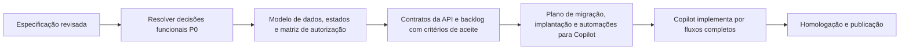

O MVP funcional está suficientemente descrito para iniciar o refinamento técnico dos fluxos definidos, mas esta versão não é um plano de implantação executável. Não há estimativa de prazo, orçamento ou percentual de implementação validado. Percentuais mencionados na conversa foram estimativas informais; acompanhar a continuidade pelos IDs de decisões abertas, artefatos entregues e critérios de aceite, sem confundir documentação com implementação validada.
