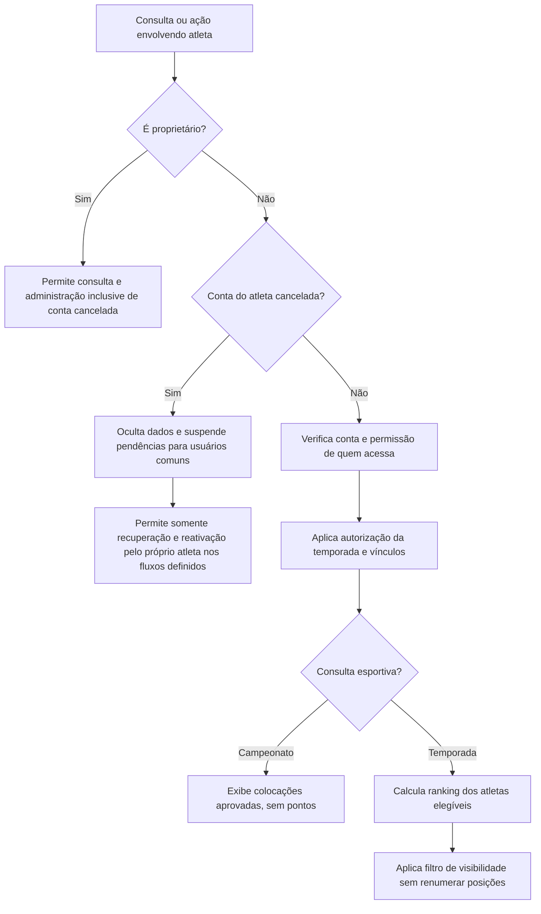

# Revisão de consistência — MVP de pontuação

Referência: [especificação v0.2](mvp-pontuacao.md). Revisão documental sobre a conversa e o documento consolidado; não inclui execução da aplicação, validação do banco ou implantação.

## Resultado

A base funcional permite iniciar o desenho técnico dos fluxos já definidos. Ainda não é uma especificação totalmente fechada para implementar de ponta a ponta. Foram harmonizadas regras antigas, acrescentadas condições transversais e organizadas 14 decisões funcionais abertas. Essas decisões não representam 14 funcionalidades novas; são limites ou detalhes de funcionalidades existentes.

Não atribuímos novo percentual: a contagem de perguntas ou de cenários de aceite não mede percentual concluído. Após D15, a especificação possui 50 cenários iniciais e 9 decisões restantes (D06–D14), sem alegação de testes implementados ou executados.

## Correções realizadas sem pedir decisões novamente

| Achado | Correção na especificação |
|---|---|
| Matriz e regras de ocultação do proprietário divergiam | D15 substituiu a restrição anterior: proprietário consulta e administra dados e pendências de atletas cancelados |
| Elegibilidade considerava somente vínculo e inscrição | Conta de atleta cancelada é excluída antes do cálculo; liberação e autenticação continuam necessárias ao acesso |
| Ocultação e filtro do observador poderiam ser confundidos | Cancelamento recalcula ranking; filtro do observador preserva as posições previamente calculadas |
| Diagramas de cancelamento de atleta mostravam apenas o atleta como autor | Incluído cancelamento pelo proprietário, sem impedir reativação autônoma do atleta |
| Tabelas genéricas de e-mail não explicitavam exceções | Matriz de notificações por estado de conta e exceção de recuperação de senha |
| Encaminhamento de demandas ao proprietário envolvendo atleta cancelado | Após D15, proprietário pode receber e tratar essas demandas; usuários comuns permanecem impedidos |
| Justificativas com diferentes regras espalhadas no texto | Tabela unificada: vínculo exclusivo do proprietário; inscrição interna sem acesso do atleta; resultado disponível ao profissional para correção |
| Lista de pendências omitia solicitações de vínculo | Incluídas as solicitações recebidas pelo profissional |
| Cenários antigos não tinham condições de conta explícitas | Pré-condições transversais, ajuste da intervenção do proprietário e novos cenários de cruzamento |
| AC30 estava fora de ordem | Ordenação corrigida sem renumerar IDs existentes |
| Pendências misturavam perguntas respondidas e decisões técnicas | Substituídas por D01–D14, definições técnicas e informações de implantação |
| Escopo de trabalho não refletia a divisão com o Copilot | Documentado: aqui documentação/automação, implementação pelo Copilot no VS Code |

## Fluxo consolidado de precedência

## Decisões a priorizar

1. **D01 — primeiro vínculo (concluída após a revisão):** vínculo automático no cadastro direto de novo atleta pelo profissional e na liberação do pré-cadastro pelo profissional selecionado. Solicitações de novos vínculos para atleta já cadastrado continuam dependendo de aprovação.
2. **D02 — aprovação sem temporada elegível (concluída após a revisão):** confirmado que o administrador convidado autorizado pode aprovar a inscrição mesmo sem vínculo do atleta com o criador. Inscrição confirmada não libera temporada sem elegibilidade. Restam 12 das 14 decisões inicialmente abertas; a especificação passou a 46 cenários de aceite.
3. **D03 — perda de autorização durante uma pendência de inscrição (concluída):** redistribuir aos profissionais atualmente elegíveis; sem nenhum, direcionar ao proprietário. Suspensão por conta de atleta cancelada prevalece. A regra não substitui aprovações pessoais do atleta. Após D03, restam 11 das 14 decisões iniciais; a especificação possui 48 cenários de aceite.
4. **D04 — remoção de inscrição com histórico (concluída):** qualquer lançamento no histórico, inclusive removido/cancelado, exige aprovação do proprietário para remover a inscrição. Remoção direta apenas se nunca houve lançamento nessa inscrição. Após D04, restam 10 das 14 decisões iniciais; a especificação possui 49 cenários de aceite.

As demais decisões estão identificadas na seção 16 da especificação. Não pressupor respostas ao criar tarefas para o Copilot.

## Limites e observações técnicas

- Documentação alterada; nenhum código da aplicação, SQL, configuração de execução ou banco foi alterado nesta revisão.
- Ocultar dados no sistema e em novas exportações não revoga arquivos já baixados. Links de download e arquivos mantidos no servidor precisam aplicar a autorização vigente.
- “Aprovação do resultado” e “aprovação da inscrição” são etapas diferentes. Uma inscrição confirmada permite ranking geral com zero; um resultado só compõe relatórios após aprovação.
- Reativação de conta não restaura inscrição, resultado ou vínculo que tenham sido cancelados/encerrados em seus próprios fluxos.
- Catálogos globais e resultados compartilhados exigem validação técnica de identidade e permissões; nenhuma escolha de framework adicional, fornecedor ou MCP foi feita nesta revisão.
- Os diagramas foram revisados estruturalmente no Markdown; não houve renderização visual em um motor Mermaid nesta etapa.

## Próxima entrega

Atualização após D15: o proprietário confirmou acesso irrestrito para consultar e administrar dados e pendências de atletas cancelados, substituindo a decisão anterior de ocultação inclusive para ele. Reativação administrativa está definida (AC50). A ocultação/suspensão permanece para usuários comuns. A conta cancelada continua excluída dos rankings vigentes; acesso administrativo não implica reativação automática nem envio de notificações ao atleta cancelado.

Com D01–D05 e D15 concluídas, é possível produzir a primeira versão do modelo conceitual e da matriz de permissões, mantendo D06–D14 explicitamente pendentes. Após as decisões necessárias, gerar contratos, backlog e critérios de validação para o Copilot. Skills, agentes e MCP serão preparados com base nesses artefatos e no ambiente de implantação escolhido.
